# Ableton MCP Extended

**Control Ableton Live using natural language via AI assistants like Claude or Cursor.**

[](https://opensource.org/licenses/MIT)
[](https://www.python.org/downloads/)
[](https://www.ableton.com/)

---

## What is Ableton MCP Extended?

Ableton MCP Extended is a powerful Model Context Protocol (MCP) server that bridges AI assistants with Ableton Live, enabling you to control your DAW through natural language conversations.

!!! example "Transform Conversations into Music"
    ```
    👤 "Create a brief minimalist/neo-classical composition..."
    🤖 "Creating MIDI clips... Adding effects... Done!"
    ```

[Watch Video Demonstration](https://www.youtube.com/watch?v=7ZKPIrJuuKk){ .md-button .md-button--primary }

---

## Key Features

### 🎹 Session and Transport Control
- Start and stop playback
- Get session info (tempo, time signature, track count)
- Set tempo and control transport

### 🎚️ Track Management
- Create, rename, and get detailed information for MIDI and audio tracks
- Control track properties: volume, panning, mute, solo, and arm
- Manage track grouping and folding states

### 🎵 MIDI Clip and Note Manipulation
- Create and name MIDI clips with specified lengths
- Add, delete, transpose, and quantize notes
- Perform batch edits on multiple notes
- Adjust clip loop parameters and follow actions

### 🎛️ Device and Parameter Control
- Load instruments and effects from Ableton's browser
- Get full list of parameters for any device
- Set and batch-set device parameters (normalized 0.0-1.0)

### 📂 Browser Integration
- Navigate and list items from Ableton's browser
- Load instruments, effects, and samples directly
- Import audio files into audio tracks

### 🎤 Voice & Audio Generation
- Text-to-Speech integration via ElevenLabs
- Custom voice creation and cloning
- Sound effects generation
- Direct import into Ableton sessions

### ⚡ Extensible Framework
- Build custom Ableton controllers
- Ultra-low latency UDP protocol
- Example: XY Mouse Controller for real-time parameter control

---

## How It Works

```mermaid
graph TB
    A[You: Natural Language] --> B[AI Assistant]
    B --> C[MCP Server]
    C --> D[Ableton Remote Script]
    D --> E[Ableton Live API]
    E --> F[🎵 Your Music]

    G[ElevenLabs AI] --> H[Generated Audio]
    H --> C
```



1. **You** issue a command in plain English to your AI assistant
2. **AI Assistant** understands intent and calls the appropriate MCP tool
3. **MCP Server** constructs a specific JSON command
4. **Ableton Remote Script** receives the command via socket connection
5. **Remote Script** executes using the official Ableton Live API
6. **Change happens instantly** in your Ableton session

---

## Quick Start

Get up and running in 5 minutes:

1. [Install the software](installation.md)
2. [Follow the Quick Start guide](quickstart.md)
3. Start creating music through conversation!

---

## Community

Made with ❤️ for the music production community

- **GitHub Issues**: [Report bugs and request features](https://github.com/uisato/ableton-mcp-extended/issues)
- **Discussions**: [Share creations and get help](https://github.com/uisato/ableton-mcp-extended/discussions)

### Share Your Creations

Tag [@uisato_](https://www.instagram.com/uisato_) with your AI-generated experiments!

[YouTube](https://www.youtube.com/@uisato_) |
[Instagram](https://www.instagram.com/uisato_) |
[Patreon](https://www.patreon.com/c/uisato) |
[Website](https://www.uisato.art/)

---

## License

This project is licensed under the MIT License - see [LICENSE](https://github.com/uisato/ableton-mcp-extended/blob/main/LICENSE) for details.

**Built with:**

- [Model Context Protocol](https://github.com/modelcontextprotocol) - AI integration framework
- [ElevenLabs API](https://elevenlabs.io) - Professional voice generation
- [Ableton Live](https://www.ableton.com) - Digital audio workstation

**Inspired by:** The original [ableton-mcp](https://github.com/ahujasid/ableton-mcp) project
